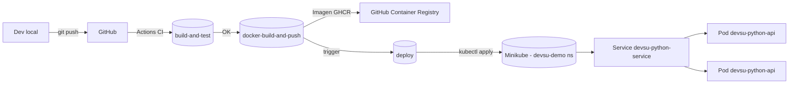

# Devsu Demo DevOps - Python

## Descripción

API REST en Django + DRF para la prueba técnica DevOps.  
El objetivo es demostrar CI/CD, dockerización y despliegue en Kubernetes (minikube).

## Arquitectura

