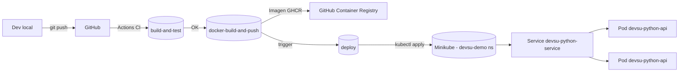

# Devsu Demo DevOps - Python

## Descripción

API REST en Django + DRF para la prueba técnica DevOps.  
El objetivo es demostrar CI/CD, dockerización y despliegue en Kubernetes (minikube).

## Arquitectura



## Ejecución local (sin Docker)

```bash
python -m venv venv
# Linux/macOS
source venv/bin/activate
# Windows (PowerShell)
# .\venv\Scripts\Activate.ps1

pip install -r requirements.txt

python manage.py migrate
python manage.py runserver 0.0.0.0:8000
```

## Probar

```bash
curl http://127.0.0.1:8000/health/
curl http://127.0.0.1:8000/api/users/
```

### Tests, coverage y flake8

```bash
coverage run manage.py test
coverage report -m
flake8
```

## Docker

```bash
docker build -t devsu-demo-python:local .
docker run --rm -p 8000:8000 devsu-demo-python:local
```

## Docker Compose

```bash
docker compose up --build
```

## Despliegue en Kubernetes (Minikube)

```bash
minikube start
kubectl config use-context minikube

kubectl apply -f k8s/namespace.yaml
kubectl apply -f k8s/configmap.yaml
kubectl apply -f k8s/secret.yaml
kubectl apply -f k8s/deployment.yaml
kubectl apply -f k8s/service.yaml
kubectl apply -f k8s/ingress.yaml
kubectl apply -f k8s/hpa.yaml

kubectl -n devsu-demo get pods,svc,ingress,hpa
```

## Acceso local

- kubectl -n devsu-demo port-forward svc/devsu-python-service 8000:8000
- curl http://127.0.0.1:8000/health/
- curl http://127.0.0.1:8000/api/users/

## CI/CD en GitHub Actions

### Workflow: .github/workflows/ci-cd.yml

### Jobs:

- build-and-test: instala dependencias, corre tests, coverage y flake8.
- docker-build-and-push: construye y publica la imagen en GHCR y corre Trivy.
- deploy: aplica manifiestos a Minikube.
